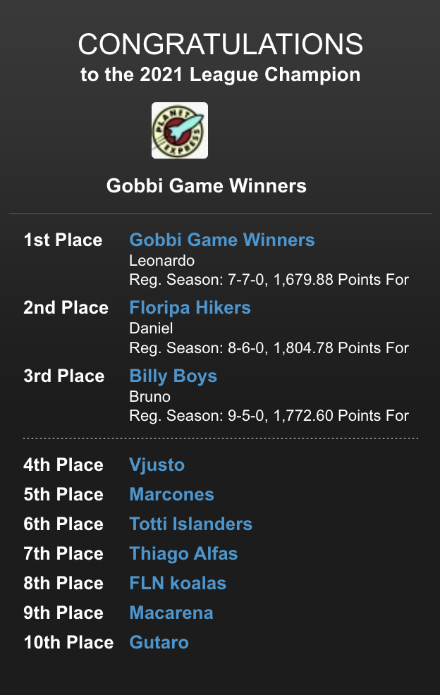
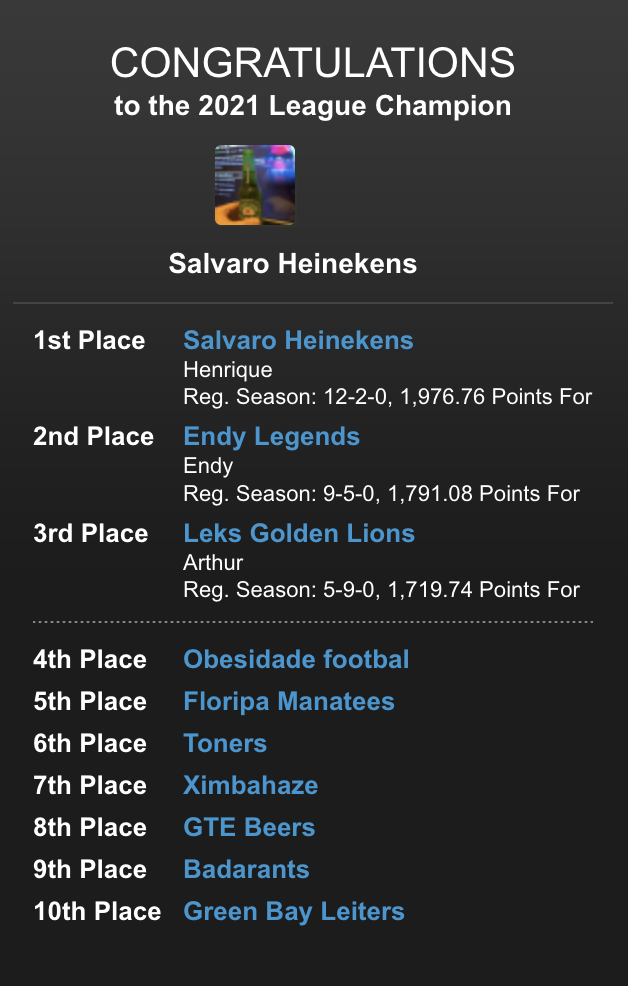

## Temporada 2021

Em 2021 a NFL Dudes contou novamente com duas Leagues de 10 pessoas (Gold e Silver), totalizando 20 times. Uma League foi destinada aos primeiros 10 colocados de 2020, a segunda League contou com os demais jogadores de 2020, além de novos membros.

Em 2021 as ordens do Draft de cada League passaram a ser definidas via sorteio, sem influências de resultados anteriores. Também não é mais possível realizar trocas de jogadores com promessa de posições em drafts futuros.

Formação:

- Quarterback (QB) - 1
- Running Back (RB) - 2
- Wide Receiver (WR) - 2
- Tight End (TE) - 1
- Kicker (K) - 1
- Defensive Team (DEF) - 1
- Wide Receiver / Running Back (W/R) - 1
- Bench (BN) - 4
- Reserve (RES) - 3

#### Draft 

**Gold**:

| Pos | Time                                  |
| --- | ------------------------------------- |
| 1.  | Gobbi Game Winners                    |
| 2.  | Florida Hikers                        |
| 3.  | FLN Koalas                            |
| 4.  | Thiago Alfas                          |
| 5.  | Macarena                              |
| 6.  | Marcones                              |
| 7.  | Gutaro                                |    
| 8.  | Totti Islanders                       |
| 9.  | Vjusto                                |
| 10. | Billy Boys                            |

**Silver**:

| Pos | Time                                  |
| --- | ------------------------------------- |
| 1.  | GTE Beers                             |
| 2.  | Toners                                |
| 3.  | Green Bay Leiters                     |
| 4.  | Ximbahaze                             |
| 5.  | Leks Golden Lions                     |
| 6.  | Endy Legends                          |
| 7.  | Salvaro Heinekens                     |
| 8.  | Obesidade Footbal                     |
| 9.  | Florida Manatees                      |
| 10. | Badarants                             |

#### Resultados

**Gold**:

**Silver**:

